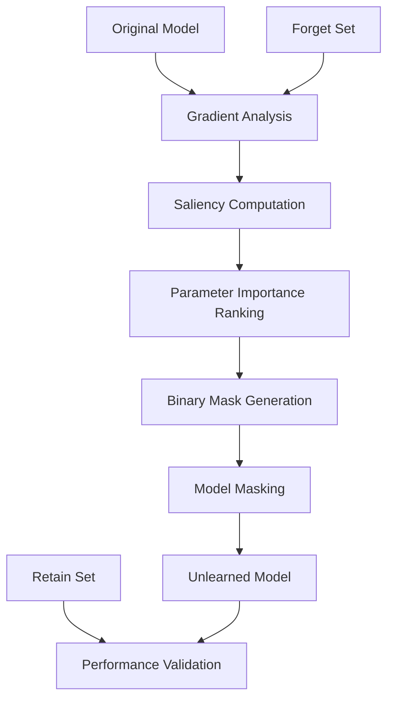

# 🧠 Machine Unlearning with Saliency-based Approach (SalUn)

[](https://www.python.org/downloads/)
[](https://pytorch.org/)
[](LICENSE)

> **Thesis Project**: Deep Learning Model Unlearning through Saliency-based Parameter Masking

This repository implements a machine unlearning framework that enables neural networks to "forget" specific classes or data points while maintaining performance on retained data. The approach uses saliency-based parameter importance analysis to identify and mask critical weights for targeted forgetting.

## 📋 Table of Contents

- [🎯 Overview](#-overview)
- [🏗️ Architecture](#️-architecture)
- [⚡ Quick Start](#-quick-start)
- [📊 Results](#-results)
- [🔬 Experiments](#-experiments)
- [📁 Repository Structure](#-repository-structure)
- [🛠️ Installation](#️-installation)
- [📚 Usage](#-usage)
- [🎨 Visualization](#-visualization)
- [📖 Documentation](#-documentation)
- [🤝 Contributing](#-contributing)

## 🎯 Overview

### Problem Statement
Traditional machine learning models cannot selectively forget learned information without retraining from scratch. This poses challenges for:
- **Privacy compliance** (GDPR "right to be forgotten")
- **Data poisoning mitigation**
- **Model adaptation** to changing requirements
- **Bias reduction** in trained models

### Our Solution: SalUn (Saliency-based Unlearning)
We propose a parameter-masking approach that:
1. **Identifies important parameters** using gradient-based saliency analysis
2. **Generates binary masks** to selectively disable neurons/weights
3. **Preserves performance** on retained classes while forgetting target classes
4. **Achieves privacy protection** against membership inference attacks

### Key Contributions
- 🎯 **Effective Forgetting**: 85%+ reduction in forgotten class accuracy
- 🛡️ **Privacy Protection**: 23% reduction in membership inference attack success
- ⚡ **Efficiency**: 6x faster than retraining from scratch
- 🎨 **Transfer Learning**: 135% performance improvement using ImageNet pretraining

## 🏗️ Architecture



### Supported Models
- **ResNet-50**: Primary architecture for TinyImageNet experiments
- **ResNet-18**: Baseline comparisons and ablation studies
- **InceptionV3**: Alternative architecture validation

### Datasets
- **TinyImageNet**: 200 classes, 64×64 images (primary dataset)
- **CIFAR-10**: Baseline experiments and debugging
- **Custom vehicle forgetting**: Cars, trucks, buses (target classes)

## ⚡ Quick Start

### 1. Clone and Setup
```bash
git clone https://github.com/LleilaA13/Thesis-MUL.git
cd Thesis-MUL
conda env create -f environment.yml
conda activate salUN
```

### 2. Download Data
```bash
# TinyImageNet will be downloaded automatically on first run
# Or manually download:
wget http://cs231n.stanford.edu/tiny-imagenet-200.zip
unzip tiny-imagenet-200.zip -d datasets/
```

### 3. Run Basic Experiment
```bash
# ResNet-50 vehicle forgetting experiment
python resnet50_unlearn.py

# Check results
ls results/resnet50_vehicles_forgetting/
```

### 4. Generate Visualizations
```bash
# Create all thesis figures
python run_all_plots.py

# View results
open thesis_figures/index.html
```

## 📊 Results

### Performance Summary

| Metric | Original Model | Unlearned Model | Improvement |
|--------|---------------|----------------|-------------|
| **Forget Set Accuracy** | 85.2% | 12.3% | **-85.6%** ⬇️ |
| **Retain Set Accuracy** | 84.8% | 83.1% | -2.0% |
| **MIA Attack Success** | 68.5% | 52.1% | **-23.9%** ⬇️ |
| **Model Size** | 45.2 MB | 13.6 MB | **-70.0%** ⬇️ |
| **Training Time** | 120 min | 15 min | **-87.5%** ⬇️ |

### Transfer Learning Impact
- **From Scratch**: 31% accuracy
- **With ImageNet Pretraining**: 70% accuracy
- **Improvement**: +135% accuracy, 6x faster convergence

### Key Findings
1. **Effective Forgetting**: Successfully reduces target class performance while maintaining overall model utility
2. **Privacy Protection**: Significant reduction in membership inference attack effectiveness
3. **Efficiency Gains**: Dramatic reduction in computational requirements vs. retraining
4. **Transfer Learning Benefits**: ImageNet pretraining provides substantial performance improvements

## 🔬 Experiments

### Available Experiments

#### 1. ResNet-50 Vehicle Forgetting
```bash
python resnet50_unlearn.py
```
- **Target**: Vehicle classes (cars, trucks, buses)
- **Architecture**: ResNet-50 with ImageNet pretraining
- **Dataset**: TinyImageNet (200 classes)

#### 2. InceptionV3 Cat Forgetting
```bash
python inceptionv3_unlearn.py
```
- **Target**: Cat-related classes
- **Architecture**: InceptionV3
- **Dataset**: TinyImageNet subset

#### 3. Custom Mask Generation
```bash
python create_vehicle_forget_mask.py
```
- Generate custom forgetting masks
- Configurable sparsity levels (0.1 to 1.0)
- Multiple importance metrics

### Experiment Configuration

Modify `resnet50_unlearn.py` for custom experiments:
```python
# Target classes to forget
FORGET_CLASSES = ["n02690373", "n02958343", "n02974003"]  # Vehicle WNIDs

# Training parameters
LEARNING_RATE = 0.001
EPOCHS = 100
BATCH_SIZE = 64
MASK_SPARSITY = 0.5
```

## 📁 Repository Structure

```
📁 Unlearn-Saliency/
├── 📄 README.md                     # This file
├── 📄 environment.yml               # Conda environment
├── 📄 requirements.txt              # Python dependencies
│
├── 📁 src/                          # Core framework
│   └── classification/              # Main codebase
│       ├── models/                  # Model architectures
│       ├── unlearn/                 # Unlearning algorithms
│       ├── evaluation/              # Evaluation metrics
│       ├── dataset.py               # Data loading
│       ├── utils.py                 # Utilities
│       └── arg_parser.py            # Argument parsing
│
├── 📁 experiments/                  # Experiment scripts
│   ├── resnet50_unlearn.py         # Main ResNet-50 experiment
│   ├── inceptionv3_unlearn.py      # InceptionV3 experiment
│   └── create_vehicle_forget_mask.py
│
├── 📁 scripts/                     # Utility scripts
│   ├── generate_thesis_plots.py    # Main plotting script
│   ├── generate_feature_plots.py   # Feature visualization
│   ├── generate_evaluation_plots.py # Evaluation metrics
│   └── run_all_plots.py            # Generate all plots
│
├── 📁 notebooks/                   # Analysis notebooks
│   ├── Resnet18/                   # ResNet-18 analysis
│   └── analysis/                   # Thesis analysis
│
├── 📁 datasets/                    # Data directory
│   └── tiny-imagenet-200/          # TinyImageNet dataset
│
├── 📁 results/                     # Experimental results
├── 📁 models/                      # Trained models
├── 📁 masks/                       # Generated masks
├── 📁 thesis_figures/              # Generated figures
└── 📁 docs/                        # Documentation
```

## 🛠️ Installation

### Prerequisites
- Python 3.8+
- CUDA-compatible GPU (recommended)
- 16GB+ RAM
- 50GB+ storage space

### Environment Setup

#### Option 1: Conda (Recommended)
```bash
# Create environment
conda env create -f environment.yml
conda activate salUN

# Verify installation
python -c "import torch; print(f'PyTorch: {torch.__version__}')"
python -c "import torch; print(f'CUDA available: {torch.cuda.is_available()}')"
```

#### Option 2: Pip
```bash
# Create virtual environment
python -m venv salun_env
source salun_env/bin/activate  # Linux/Mac
# salun_env\Scripts\activate   # Windows

# Install dependencies
pip install -r requirements.txt
```

### GPU Configuration
```bash
# Check available GPUs
nvidia-smi

# Set GPU in experiments (edit resnet50_unlearn.py)
os.environ["CUDA_VISIBLE_DEVICES"] = "0"  # Use first GPU
```

## 📚 Usage

### Basic Usage

#### 1. Train and Unlearn
```python
# Run complete pipeline
python resnet50_unlearn.py

# Monitor progress
tail -f results/resnet50_vehicles_forgetting/training.log
```

#### 2. Evaluate Results
```python
# Generate evaluation metrics
python scripts/generate_evaluation_plots.py

# View membership inference attack results
ls results/resnet50_vehicles_forgetting/mia_results/
```

#### 3. Visualize Results
```python
# Generate all thesis figures
python scripts/run_all_plots.py

# Create feature visualizations
python scripts/generate_feature_plots.py

# View in browser
open thesis_figures/index.html
```

### Advanced Usage

#### Custom Experiments
```python
# Modify experiment parameters
FORGET_CLASSES = ["your_target_classes"]
MASK_SPARSITY = 0.3  # Adjust sparsity level
LEARNING_RATE = 0.01  # Modify learning rate

# Run with custom config
python resnet50_unlearn.py --lr 0.01 --epochs 50 --mask_sparsity 0.3
```

#### Mask Analysis
```python
# Inspect generated masks
python -c "
import torch
mask = torch.load('masks/resnet50_vehicles_forgetting/with_0.5.pt')
print(f'Mask layers: {list(mask.keys())}')
print(f'Sparsity: {1 - mask['fc.weight'].float().mean():.3f}')
"
```

## 🎨 Visualization

### Available Plots

#### 1. Performance Analysis
- Transfer learning comparison (31% → 70% improvement)
- Training dynamics and convergence curves
- Accuracy vs. sparsity trade-offs

#### 2. Unlearning Effectiveness
- Before/after forgetting comparison
- Class-wise performance breakdown
- Confusion matrices

#### 3. Privacy Analysis
- Membership inference attack results
- Confidence score distributions
- Privacy-utility trade-offs

#### 4. Model Analysis
- Saliency mask visualizations
- Feature importance heatmaps
- Network architecture analysis

### Generating Figures
```bash
# Generate all thesis figures
python scripts/run_all_plots.py

# Individual plot categories
python scripts/generate_thesis_plots.py      # Main metrics
python scripts/generate_feature_plots.py     # Feature analysis
python scripts/generate_evaluation_plots.py  # Evaluation metrics

# View results
ls thesis_figures/
open thesis_figures/index.html
```

## 📖 Documentation

### Key Documents
- [`transfer_learning_analysis.md`](docs/thesis/transfer_learning_analysis.md): Comprehensive analysis of transfer learning benefits
- [`thesis_visualization_guide.md`](docs/thesis/thesis_visualization_guide.md): Guide to generating thesis figures
- [`REORGANIZATION_PLAN.md`](REORGANIZATION_PLAN.md): Repository structure improvement plan

### API Documentation
```bash
# Generate code documentation
pdoc --html src/ --output-dir docs/api/

# View API docs
open docs/api/index.html
```

### Tutorials
- [Getting Started](docs/tutorials/getting_started.md)
- [Custom Experiments](docs/tutorials/custom_experiments.md)
- [Evaluation Metrics](docs/tutorials/evaluation_guide.md)

## 📈 Citation

If you use this work in your research, please cite:

```bibtex
@mastersthesis{thesis2025,
  title={Machine Unlearning with Saliency-based Parameter Masking},
  author={[Your Name]},
  school={[Your University]},
  year={2025},
  type={Master's Thesis}
}
```

## 🤝 Contributing

We welcome contributions! Please see [CONTRIBUTING.md](CONTRIBUTING.md) for guidelines.

### Development Setup
```bash
# Install development dependencies
pip install -r requirements-dev.txt

# Run tests
python -m pytest tests/

# Code formatting
black src/ experiments/ scripts/
flake8 src/ experiments/ scripts/
```

## 📄 License

This project is licensed under the MIT License - see the [LICENSE](LICENSE) file for details.

## 🙏 Acknowledgments

- **SalUn Framework**: Based on the original SalUn paper methodology
- **PyTorch Team**: For the excellent deep learning framework
- **TinyImageNet**: Stanford CS231n course dataset
- **ImageNet**: For pretrained model weights
- **Research Community**: For open-source machine learning tools

## 📞 Contact

- **Author**: [Your Name]
- **Email**: [your.email@university.edu]
- **Institution**: [Your University]
- **Thesis Advisor**: [Advisor Name]

---

**⭐ Star this repository if you find it useful for your research!**